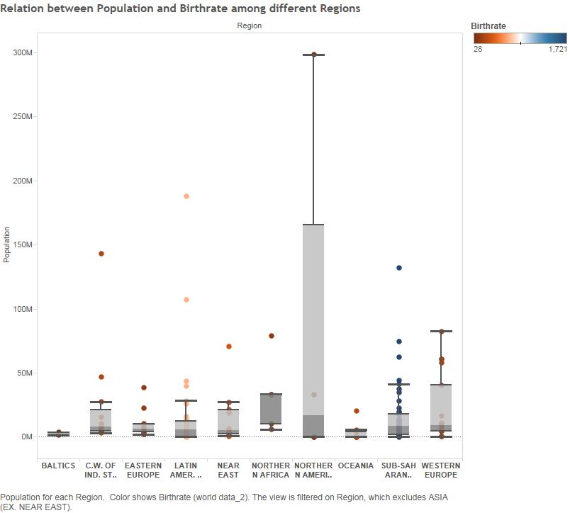
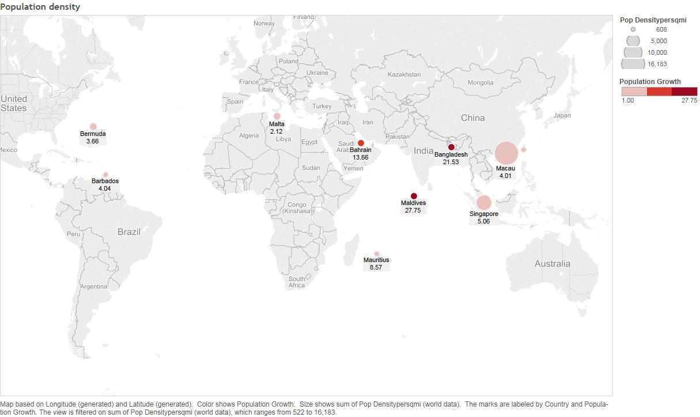
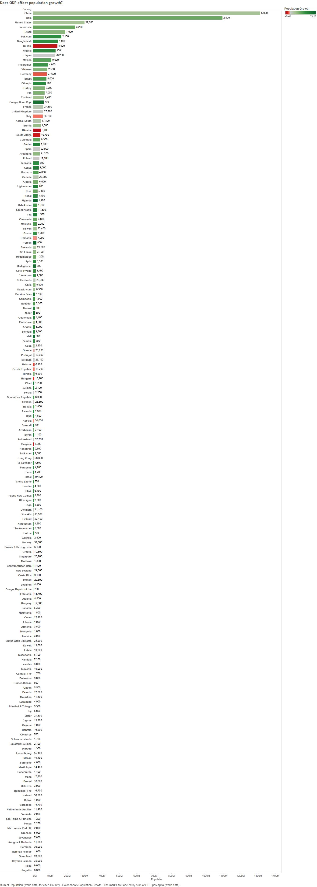
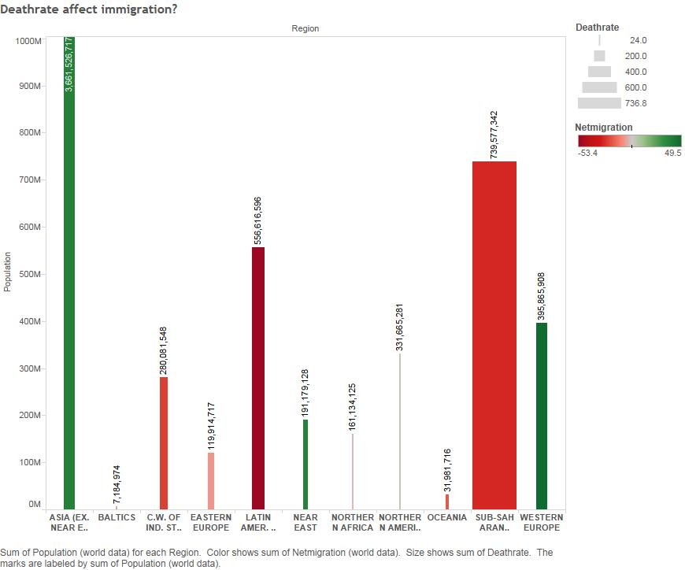

we have two data sets related by region and country.  They contain information on a country's statistics whether it be business or agriculturely related.

Columns: Region
Rows: Population
Filtered by region and marked by birthrate

We wanted to see the relationship between a population of countries grouped by region and included birthrate.

      

With tableau and with the nature of our data set of world data, we wanted to utilize tableau's map function and show population density.

Marks include: Population growth, countryr, population density

      

GDP is good indicator of how productive and prosperous a country's economy is. We were curious of the relationship between a country's population and GDP. 

Columns: sum(population)
Rows: country
Marks: AGG(Population growth) and sum(GDP)

      

A relationship with deathrate and immigration. Correlation doesn't necesssarily mean causation.

      

